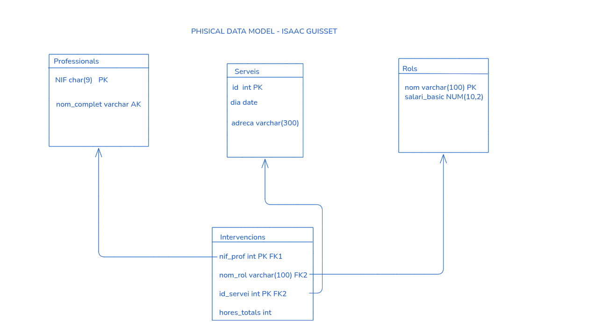
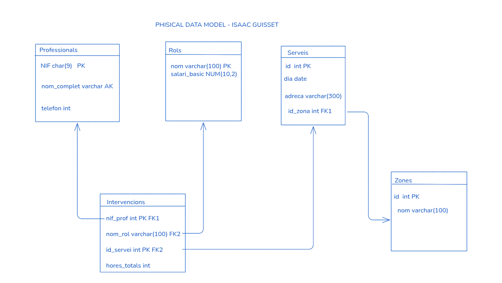

##### Isaac Guisset Sánchez
# EXERCICI AUTOAVALUABLE_2 BASE DE DADES

## PHISICAL DATA MODEL (ABANS DE LES MODIFICACIONS)

## PHISICAL DATA MODEL DESPRÉS DE LES MODIFICACIONS


## Creació de les taules 
#### PROFESSIONALS

```sql
create table Professionals(
NIF char(9) not null,
nom_complet varchar(300) not null,
-- clau primària
constraint pk_Professionals PRIMARY KEY (NIF),
-- clau alternativa
constraint ak_Professionals UNIQUE (nom_complet)

);
```
#### ROLS

```sql
create table Rols(
nom varchar(100) not null,
salari_base NUMERIC(10,2) not null,
-- clau primària
constraint pk_Rols PRIMARY KEY (nom)
);
```
#### SERVEIS

```sql
create table Serveis(
id int not null,
dia date not null,
adreca varchar(300) not null,
-- clau primària
constraint pk_Serveis PRIMARY KEY (id)
);
```
#### INTERVENCIONS

```sql
create table Intervencions(
nif_prof char(9) not null,
nom_rol varchar(100) not null,
id_servei int not null,
hores_totals int not null,
--clau primària
constraint pk_Intervencions PRIMARY KEY(nif_prof, id_servei),
-- clau forana de intervencions a professionals
constraint fk1_Intervencions_a_Professionals FOREIGN KEY (nif_prof)
references Professionals(NIF)
on update cascade
on delete no action,
-- clau forana de intervencions a rols
constraint fk2_Intervencions_a_rols FOREIGN KEY (nom_rol)
references Rols(nom)
on update no action 
on delete cascade,
-- clau forana de intervencions a serveis
constraint fk3_Intervencions_a_Serveis FOREIGN KEY (id_servei)
references Serveis(id)
on update cascade
on delete cascade

);
```

## COMPORTAMENT DE LES CLAUS FORANES

### **FK1** *INTERVENCIONS A PROFESSIONALS* 
---
- on delete = no action 
- on update = cascade

### **FK2** *INTERVENCIONS A ROLS* 
---
- On delete = no action 
- on update = cascade

### **FK3** *INTERVENCIONS A SERVEIS* 
---
- On delete = cascade 
- on update = cascade

## AFEGIR DADES A LES TAULES

### Professionals

```sql
INSERT INTO Professionals(NIF, nom_complet)
values
('12345678A', 'Joan Martí Soler'),
('23456789B', 'Maria Puig Vidal'),
('34567890C', 'Pere Casals Font'),
('45678901D', 'JLaura Ribas Coma');
```
### Rols

```sql
INSERT INTO Rols (nom, salari_base)
VALUES
('Supervisor', 25.50),
('Netejador', 15.00),
('Especialista', 20.00);

```

### Serveis

```sql
INSERT INTO Serveis (id, dia, adreca)
VALUES
(1, '2024-01-15', 'Carrer Major 123, Barcelona'),
(2, '2024-01-16', 'Avinguda Diagonal 456, Barcelona'),
(3, '2024-01-17', 'Plaça Catalunya 78, Barcelona');
```

### Intervencions

```sql
INSERT INTO Intervencions (nif_prof, nom_rol, id_servei, hores_totals)
VALUES
('12345678A', 'Supervisor', 1, 4),
('23456789B', 'Netejador', 1, 6),
('34567890C', 'Netejador', 1, 6),
('12345678A', 'Supervisor', 2, 3),
('45678901D', 'Especialista', 2, 5),
('34567890C', 'Supervisor', 3, 4),
('23456789B', 'Netejador', 3, 6);
```
## MODIFICACIONS DE L'ESQUEMA

1. Afegeix una columna telefon (nullable) a la taula professionals.

```sql
ALTER TABLE Professionals
ADD telefon int;
```
2. Crea una taula zones amb els camps id pk i nom ak1.
```sql
CREATE TABLE Zones(
id int not null,
nom varchar(100) not null,
constraint pk_Zones PRIMARY KEY (id),
constraint ak_Zones UNIQUE (nom)
);
```
3. Insereix tres zones: Nord, Sud, Centre.

```sql
INSERT INTO Zones(id,nom)
values
(1,'Nord'),
(2, 'Sud'),
(3, 'Centre');
```
4. Afegeix un camp zona_id (nullable) a serveis, converteix-lo en clau forana cap a zones.
```sql
ALTER TABLE Serveis
ADD zona_id int,
constraint fk_Serveis_a_Zones FOREIGN KEY (zona_id)
references Zones(id)
on delete set null
on update cascade
;
```
Si s'esborra una zona, els serveis d'aquella zona haurien de quedar amb zona_id NULL.
Si s'actualitza l'id d'una zona, cal propagar el canvi als serveis.
```sql
constraint fk_Serveis_a_Zones FOREIGN KEY (zona_id)
references Zones(id)
on delete set null
on update cascade
```
7. Assigna zones als serveis existents.
```sql 
UPDATE Serveis
SET zona_id = 3
WHERE id = 3;
```
8. Crea una restricció CHECK a la taula intervencions per assegurar que hores_totals és sempre major que 0.
```sql
ALTER TABLE Intervencions 
ADD CONSTRAINT chK_Intervencions CHECK(hores_totals>0);
```

9. Afegeix una columna observacions (nullable, tipus TEXT) a la taula serveis.

```sql
ALTER TABLE Serveis
ADD observacions varchar(500);
```


